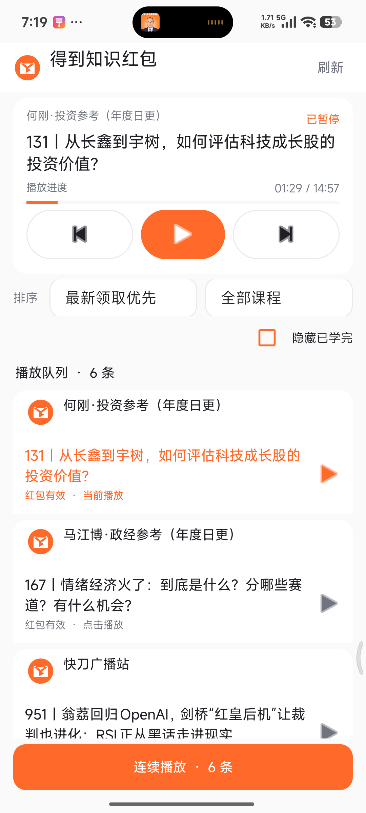

# 得到知识红包伴侣

把得到 App 中仍有效的知识红包整理成可筛选、排序、连续播放的队列，
鉴权、权益校验和音频播放始终由得到官方 App 完成。



## 当前实现

- 普通同步通过得到自己的登录态确认权益，只回传播放所需的白名单字段；
- 无障碍服务仅作为旧版得到或特殊机型的兼容路径；
- 支持新旧顺序、课程筛选和隐藏已学完；
- 支持查看完整播放队列，并在管理模式中拖动条目调整连续播放顺序；
- 新缓存中的每条内容通过 `audio_id + DDPlayerService action=open` 精确点播，
  不依赖得到当前播放队列；旧缓存才使用队列同步兼容路径；
- MediaSession 负责读取官方标题、进度和播放状态；通知访问服务识别播完状态并
  以伴侣队列的下一条 `audio_id` 续播，并用周期采样补偿偶发漏回调；
- 连续播放期间启动前台守护并持有可续期的 CPU 唤醒，得到媒体通知会触发即时检测，
  在系统允许后台运行时支持息屏后自动衔接；手动暂停或队列结束后自动释放；
- 通知访问授权和服务连接状态分别判断；服务被系统清理后自动执行解绑/重绑，
  不再要求用户反复开关授权；
- 上一条/下一条以得到的实时标题定位，切换后读回实际标题与播放状态；后台切换未生效时
  会短暂唤起官方文章页重试，失败后也会及时恢复按钮，不会一直停在“正在切换”；
- 播放/暂停同时走 MediaSession 和得到服务命令并校验真实状态；暂停时暂挂连续队列，
  恢复播放时自动恢复队列；
- 直控调用失败或队列顺序变化时，保留原无障碍流程作为兼容路径；
- 不下载、不导出、不解密音频，也不读取得到的私有数据目录。

## 使用前提

1. 安装并登录得到官方 App。
2. 开启“知识红包伴侣连续播放”通知访问权限。
3. 允许显示播放通知（与通知访问是独立授权）。若系统限制后台运行，完成省电豁免。
   小米 / HyperOS 还需在应用信息中开启“自启动”，并设省电策略为“无限制”；仅省电
   豁免仍可能被 Greezer 冻结。建议在最近任务中锁定伴侣，避免一键清理。
4. 首次点击“同步有效红包”；以后刷新时只需让得到确认当前权益。
5. “兼容模式”只用于刷新列表或切换失败时兜底，不是连续播放授权；不开启不会撤销连续播放权限。

遇到同步不返回或机型兼容问题，可点击首页右上角“设置”查看后台设置说明、复制诊断。

## 下载

当前验收分支为 `codex/kotlin-refactor`（`0.4.0-kotlin-rc2`）。原 13 个应用源文件与
5 个测试文件已迁移为 Kotlin，保留原有包名、缓存格式、权限和播放链路。延续播放完成后的
事件响应与重试优化、统一播放控制图标，支持从本地队列移除单条内容及恢复。删除当前播放
条目会切到后续条目；暂停时删除不会自动开始播放。移除记录在刷新和重启后保留，
不修改得到账号中的内容。

测试包在此分支构建，验收通过前不合并 `main`，也不替换正式下载。
Kotlin 和 Java 都受 Android 相同的后台与电源管理约束，仅切换语言不能消除厂商冻结
或官方播放器加载延迟。真机结果见 [Kotlin 验收记录](docs/kotlin-refactor-validation.md)。

RC2 修复刷新后停留在得到的问题：由得到前台确认页通过原生导航返回伴侣，首页复用
现有实例。若当前得到版本不支持回跳，使用“红包已刷新”通知兜底；点击即可返回，
红包结果已经保存，不必重复刷新。详见 [刷新回跳验证](docs/refresh-return-validation.md)。

[下载 0.3.2 APK](https://github.com/dingaiminGIT/knowledge-redpacket-companion/releases/download/v0.3.2/knowledge-redpacket-companion-0.3.2.apk)

## 构建与验证

```bash
JAVA_HOME=/opt/homebrew/opt/openjdk@17/libexec/openjdk.jdk/Contents/Home \
  ./gradlew testDebugUnitTest assembleDebug lintDebug
```

调试 APK：`app/build/outputs/apk/debug/app-debug.apk`

页面导航脚本回归：`node scripts/test-bridge-page.mjs`。

## 隐私与边界

本项目不提供官方内容、登录凭据或安装包，不绕过访问权限，也不下载、导出或解密音频。
请仅在你本人有权访问的内容与设备上使用。源码按 MIT License 发布。
